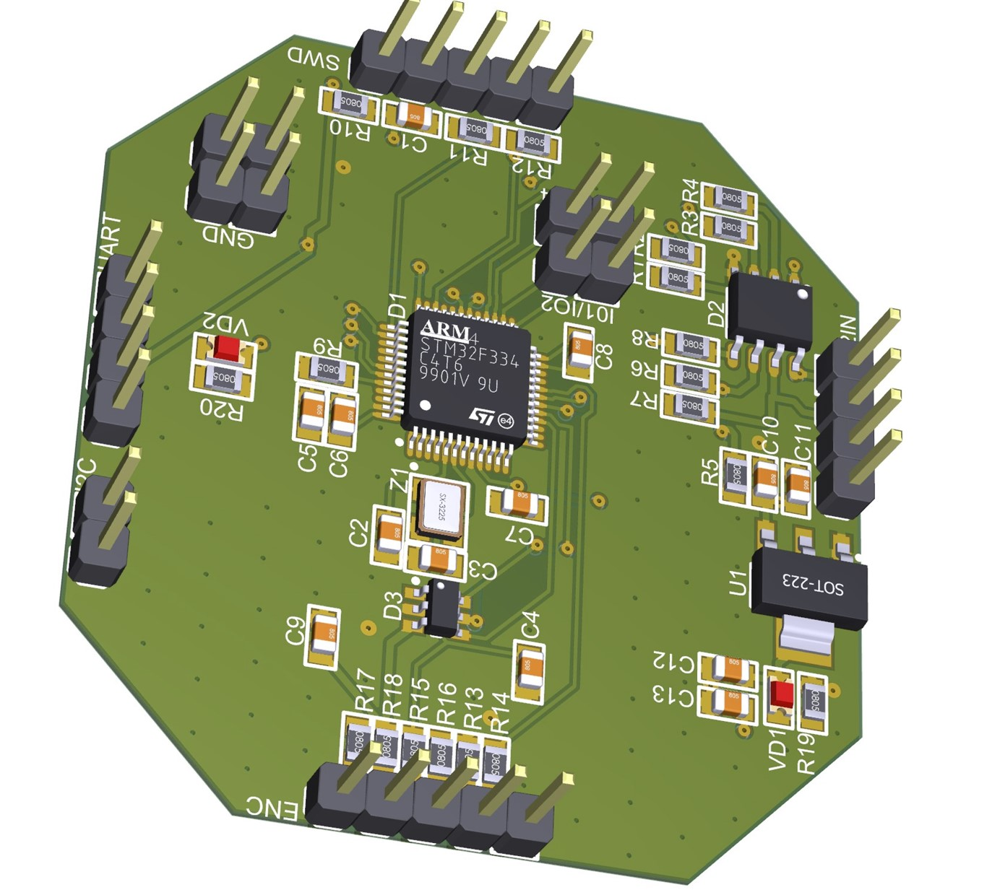
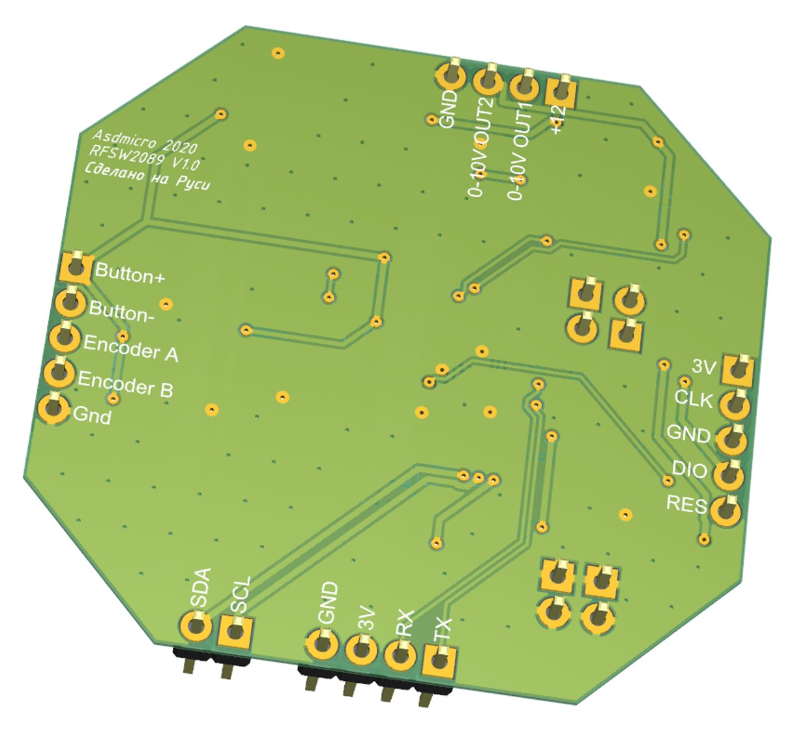
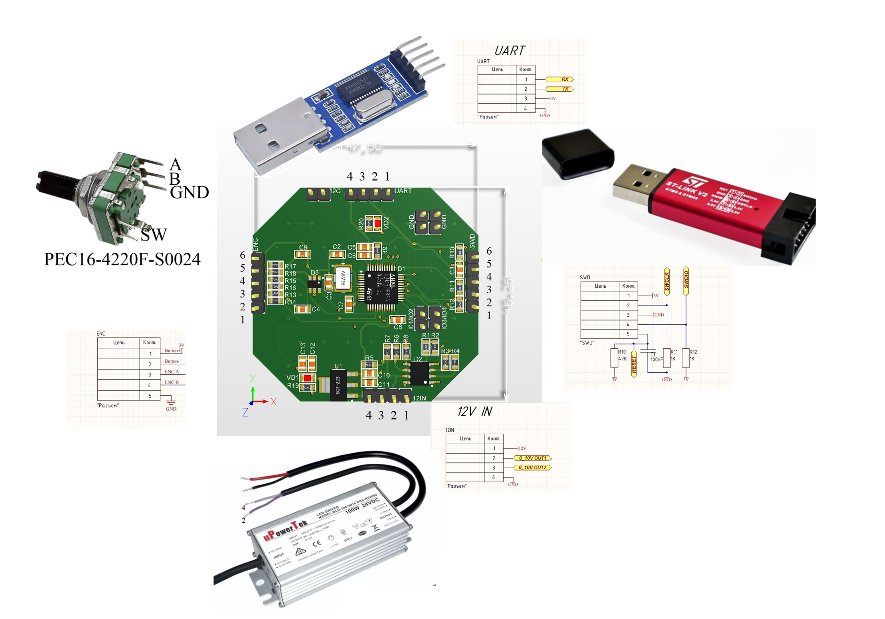

<h1 align = "center">🌟DIMMER 0-10V LED🌟</h1>

## Frimware
Compiled firmware for loading into the STM32F030 microcontroller.

- [FW](./fw/F030_010.hex)

## Schematic

- [DIMMER 0-10V LED_V1](./sh/0_10v_SH.pdf)

## At commands
AT commands are sent by connecting a USB TTL converter to UART-labeled pins.

1.  at+scale: Set the maximum voltage output, for example, 5V, so that the voltage does not exceed 5 volts when the encoder is turned to its maximum position.
2.  at+speed: Set the speed at which the brightness changes when the encoder knob is turned.
3.  at+preset1: Set the brightness when the device is powered on.
4.  at+preset2: Set the brightness when the encoder button is pressed.
5.  at+preset3: Set the brightness when the encoder button is double-pressed.
6.  at+preset4: Set the brightness when the encoder button is triple-pressed.
7.  at+defpreset: Reset all settings to their default values.

## Description

This project uses an analog signal generated by an operational amplifier to control lighting via the 0-10V protocol. 
The use of a Schmitt trigger on two inputs prevents false triggering and improves reliability.The software for this project is 
written in the C programming language using the IAR development environment. 

FreeRTOS is used to provide multitasking and thread management, allowing for parallel task execution based on priority and 
resource allocation.

The stm32F030 microcontroller is chosen for this project due to its sufficient performance and peripheral devices, 
such as ADCs and DACs, for lighting control implementation.

Overall, this project serves as an example of using a microcontroller to control an analog signal, as well as applying techniques and 
tools to ensure stable and reliable device operation.